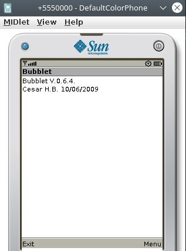
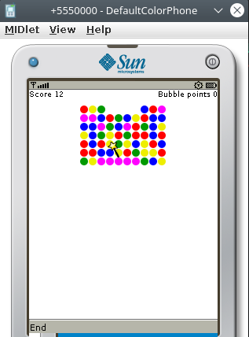
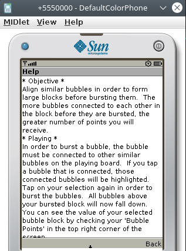

Bubblet for J2ME.

(c) César Hernández Bañó (10/06/2009)

This is my version of Bubblet game (origin on PalmOs devices) for J2ME 

You can test it on an old phone with J2ME support or in Sun Java Wireless Toolkit

Some screenshots:

